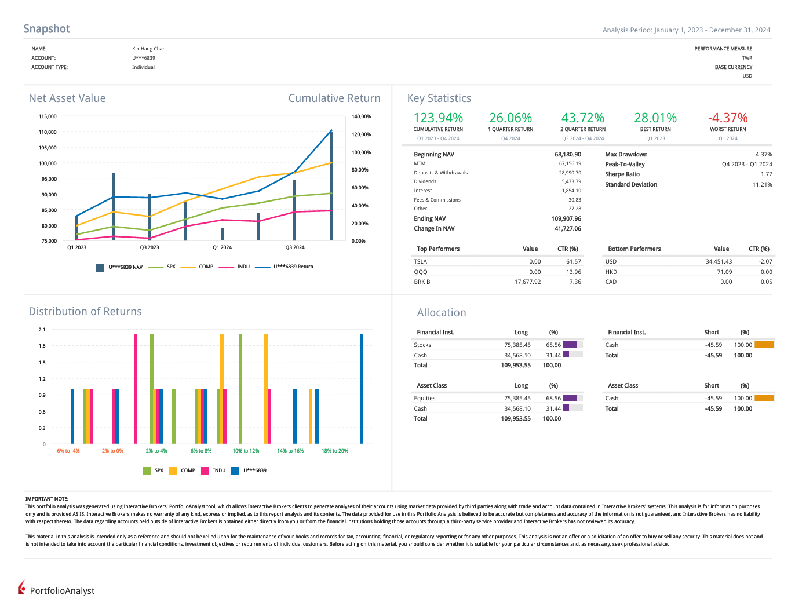

## Hi there 👋  

### View My Portfolio Analysis  
  
*Snapshot of my portfolio performance (Q1 2023 - Q4 2024).*  

### My Max Drawdown Outperforms Most Top-Performing Traders on  
- [eToro](https://www.etoro.com/copytrader/)  
- [ZuluTrade](https://www.zulutrade.com/leaders)  

### 📌 Copy My Trades on PU Prime or eToro  
The same trades are executed on both platforms, giving you flexibility to follow on your preferred one:  
- 🔍 **Look for "KinHang Chan Trading"** on [PU Prime App](https://copytrading.puprime.com/) to explore my active trades and portfolio performance.  
- 📊 Follow my **[eToro profile - Kin Hang Chan](https://www.etoro.com/people/thombert_chan)** to track my trades, view my performance, and read latest market insights.  

### 🚀 Discover My Trading Ideas  
- [TSLA under Recession](https://www.tradingview.com/chart/TSLA/kSHKWM8K-TSLA-under-Recession/)  

### 🔥 Why Follow My Trades?  
- **Superior Risk Management**  
  Disciplined strategies are employed to protect investments, resulting in a low maximum drawdown of just **4.37%**.  
- **Consistent Outperformance**  
  Achieved a cumulative return of **123.94%** from Q1 2023 to Q4 2024, consistently surpassing market benchmarks.  
- **Transparency and Insight**  
  Comprehensive portfolio analyses and regular updates provide full transparency into trading decisions, helping followers make informed choices with confidence.  

### 🎯 Start Copying My Trades Today!  
Join the growing number of traders replicating successful strategies:  
- 📈 **[PU Prime App](https://copytrading.puprime.com/)** – Follow and copy trades instantly.  
- 📊 **[eToro - Kin Hang Chan](https://www.etoro.com/people/thombert_chan)** – Track performance and gain insights from my posts.  
