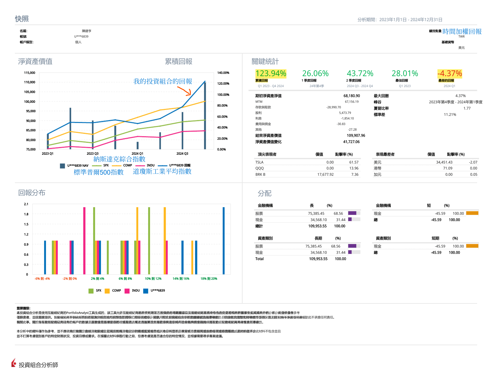

### 您好 👋  

### 📈 查看我的投資組合分析  
  
*我的投資組合表現快照 (Q1 2023 - Q4 2024).*  

### 📉 我的最大縮減優於大多數表現最佳的交易者。 
- [eToro](https://www.etoro.com/copytrader/)  
- [ZuluTrade](https://www.zulutrade.com/leaders)  

### 📌 在 PU Prime 或 eToro 上複製我的交易  
相同的交易在兩個平台上執行，讓您可以靈活地在您喜歡的平台上跟進：  
- 📊 跟蹤我的[**eToro profile - Kin Hang Chan**](https://www.etoro.com/people/thombert_chan)，追蹤我的交易、檢視我的表現，以及閱讀最新的市場見解。 

### 💡 發掘我的交易理念  
- [衰退中的 TSLA](https://www.tradingview.com/chart/TSLA/kSHKWM8K-TSLA-under-Recession/) (2025-01-16)
- [持有 Nvidia：利用人工智能的成長](Nvidia%2025-02-25.md) (2025-02-25)

### 🔥 為什麼要追蹤我的交易？ 
- 🛡️ **優越的風險管理**  
  採用嚴謹的策略來保護投資，因此最大回撤僅**4.37%**。 
- 📈 **持續的優異表現**  
  自 2023 年第一季至 2024 年第四季，累計回報率達到 **123.94%**，持續超越市場基準。 
- 🔎 **透明度與洞察力**  
  全面的投資組合分析與定期更新提供交易決策的完全透明度，協助追隨者有信心地做出明智選擇。 

### 🚀 今天就開始複製我的交易！ 
加入複製成功策略的交易者行列：  
- 📊 **[eToro - Kin Hang Chan](https://www.etoro.com/people/thombert_chan)** - 追蹤表現並從我的文章中獲得洞察力。 

### ⚠️ **風險警告**  
交易涉及風險，過去的表現並不保證未來的結果。 
強烈建議**不要分配超過您總資產淨值的10%**來複製我的交易，並且**不要在少於5年的時間內提取資金**。 
請務必評估您的風險承受能力，並做出明智的財務決策。 
